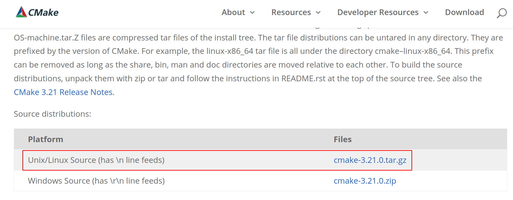

## CMake源码编译安装

### CMake源码下载

从链接[https://cmake.org/download/](https://cmake.org/download/)下载最新的源码包。



### CMake源码编译

根据readme文件，有下列命令

``` bash
./bootstrap       # 构建makefile
make              # 编译
sudo make install # 安装
```