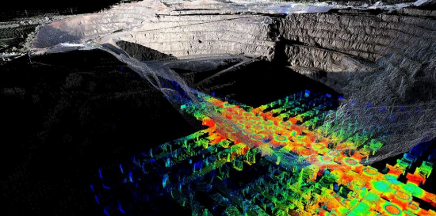
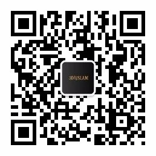
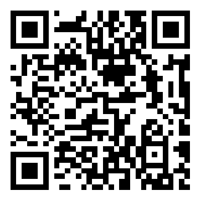

# 三维点云处理：算法与实战

本课程是3D视觉工坊的课程，计算机视觉的最终体现是三维视觉，而三维视觉的表达方式则是点云，点云处理在整个三维视觉领域占有非常重要的地位，几乎涉及到所有相关领域，例如自动驾驶感知定位、SLAM、三维场景重建、AR/VR、SFM、姿态估计、三维识别、结构光、立体视觉、三维测量、视觉引导等。

## 课程目录

- 绪论（肖老师）
  + 点云数据、获取和应用领域
  + 点云处理基本算法介绍
  + 常用点云软件及开源库介绍
- PCL基础（子宽）
  + PCL介绍与配置
    + 编程必备的一些基本概念
    + PCL设计理念与基本架构
    + 如何配置PCL以及使用
  + PCL库编译（Win+Linux）
  + PCL中的类介绍
  + 自定义PCL的点类型
  + 在项目中使用PCL库
- PCL中的数据读取及可视化（子宽）
  + PCL支持的点云格式与硬件设备
  + 常用点云数据集介绍
  + PCL中的点云存储格式
    + PCD格式介绍
    + PCD文件的读取与写入
    + PCD与PLY和LAS数据格式的转换
  + PCL中的数据结构
    + KD-Tree
    + Octree

  + 点云的可视化
    + Visualization模块介绍
    + PCLVisualizer可视化类
6、点云和其它类型数据的转换
    + 点云和图像的转换
    + 点云和深度图的转换
- 点云滤波（子宽）
  + 经典滤波方法介绍
    + 直通滤波器
    + 体素滤波器
    + 统计滤波器
    + 条件滤波
    + 半径滤波器
    + 双边滤波
    + 高斯滤波
    + 随机采样一致滤波
    + VoxelGrid滤波
  + 针对机载激光雷达的滤波方法
    + 渐进三角网滤波
    + 布料滤波方法
- 点云关键点、特征描述与提取（肖老师）

  + 点云关键点
  + 点云特征描述及提取
    + pcl_features库
    + 法线特征
    + SHOT
    + PFH & FPFH
    + VFH特征
    + NARF特征
    + Eigenvalue
  + 点云识别与检索
    + 点云识别
    + 点云检索
  + 项目实战：基于Eigenvalue的特征提取与可视化
- 点云分割算法（子宽）
  + 点云分割的基本概念
  + 经典分割算法
    + RANSAC方法
    + 基于聚类方式的分割算法
    + 基于霍夫变换的分割算法
    + 基于生成方式的分割算法
    + 基于颜色方式的分割算法
    + 基于体素方式的分割算法
  + 基于深度学习的语义分割算法
  + 点云分割实战讲解：杂乱点云数据的分割

- 点云配准基础（肖老师）
  + 点云配准介绍
  + ICP算法及其变种
  + NDT
  + 基于特征方式的配准方法
  + 项目实战：ICP 及其变种实现
- 点云多帧配准（肖老师）
  + 多帧配准介绍
  + 图优化
  + Lidar SLAM
  + RGB-D SLAM
- 点云重建模块（肖老师）
  + 凸包算法
  + 曲面重建
  + 三角化方法
  + 点云补全
- 点云处理进阶模块（子宽+肖老师）
  + 实现基于vtk与pcl的点云可视化软件（源码+详细讲解）
  + 自动驾驶场景中基于点云数据的定位实战讲解（源码+数据）

公众号二维码：

[课程二维码](https://lgo.h5.xeknow.com/s/2yFy3W)：

