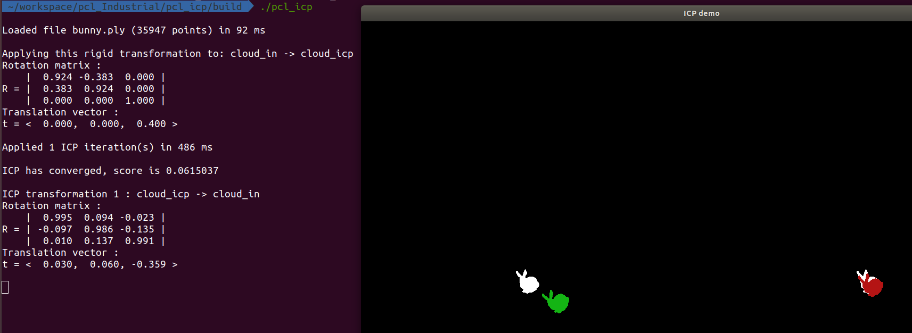
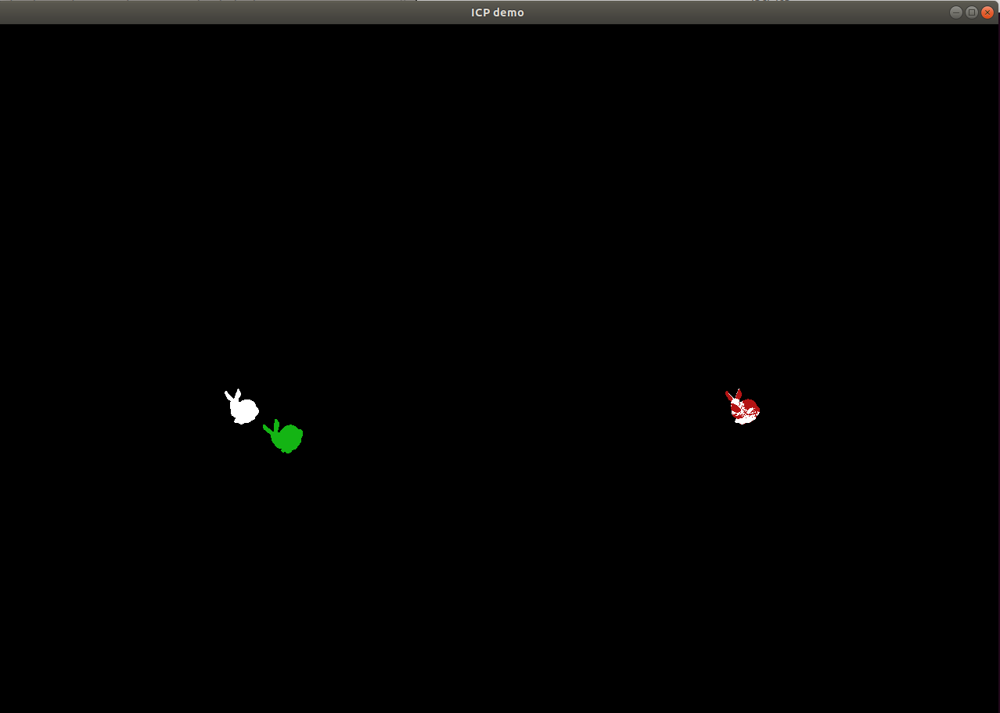

## 第三次作业

### 编译代码

切换到**03-icp**目录中，新建**build**文件夹。

``` bash
cd 03-icp # 你的目录
mkdir build && cmake ..
make -j
```

### 注意事项

**CMakeLists.txt**中的**target_include_directories**，使用Ubuntu1804从官方源安装的Cmake3.10不能识别，所以会编译失败，这里我选择重新编译CMake3.21.0并安装到系统。

源代码中的48行：bunny.ply位置需要根据你的文件位置来更改。

### 运行

切换到build文件夹内，直接执行pcl_icp,在**icp_demo**窗口（非命令行窗口）中输入空格，即可进行迭代运算。

``` bash
cd build
./pcl_icp
```

运行


输入**space**迭代
